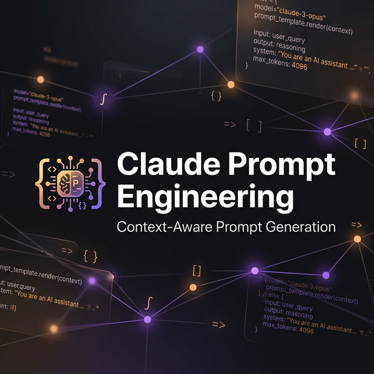

# Claude Prompt Engineering

<p align="center">
  
</p>

> Expert prompt engineering skill for [Claude Code](https://claude.ai/code). Creates optimized, context-aware prompts for any task, any model, any use case.

Built from official Anthropic sources — not academic frameworks, not guesswork.

## Why Generate Prompts Inside an AI That Already Knows What to Do?

Because sometimes **you need to leave**. You're deep in a coding session, you hit a wall — missing domain knowledge, need a legal review, need market research, need to analyze a dataset. Your current AI doesn't have that context, or you need a different tool for the job.

Instead of context-switching, losing focus, and manually writing a prompt for Gemini, Perplexity, ChatGPT, or another LLM — you just say **"write me a prompt for deep research on X"**. The skill:

1. **Reads your current context** — what you're building, what stack you're using, what problem you're solving
2. **Generates an optimized prompt** — with the right structure, real variables from your project, and the right format for the target model
3. **You paste it into another tool** — and get back exactly what you need, without losing your flow

**Common use cases:**
- You're building a fintech app → need a deep research prompt about compliance regulations → send to Perplexity
- You're writing an API → need a prompt to generate test data that matches your schema → send to GPT-4
- You're debugging → need a prompt to analyze logs with specific patterns → send to Gemini with your files
- You need a system prompt for a chatbot you're building → generate it right here, already matching your codebase

**TL;DR**: It's a prompt factory that understands your project context and produces ready-to-use prompts for any AI tool — so you never break your flow.

## What It Does

You say **"write me a prompt for..."** — it automatically gathers context from your current session, then builds a production-ready prompt using a structured 10-part framework derived from Anthropic's own documentation.

### Before (what you type)

```
write a prompt for a customer support chatbot
```

### After (what you get)

A complete, structured prompt with:
- Role and persona definition (auto-detected from your project domain)
- Task context and rules
- 3-5 few-shot examples (using real data from your session when available)
- Input/output XML structure
- Edge case handling
- Fallback behavior
- Output format (matched to your downstream needs)
- Model recommendation
- Tuning tips

## Features

| Feature | Description |
|---------|-------------|
| **Context-Aware (Phase 0)** | Automatically scans session, project files, and conversation to infer model, stack, persona, and format |
| **10-Part Framework** | Systematic prompt structure from Anthropic's interactive tutorial |
| **6 Task Templates** | Classification, Extraction, Creative, Chatbot, Code Gen, Analysis/RAG |
| **Multi-Model** | Claude 4.x, GPT-5/4o, Gemini 2.x, Llama 4, DeepSeek, Mistral — model-specific adaptations |
| **Advanced Techniques** | Reflexion, ReAct, Tree of Thoughts, Skeleton-of-Thought, Emotion Prompting, Self-Consistency, Directional Stimulus |
| **Meta-Prompting** | Contrastive Learning (LCP) optimization, Meta-Expert orchestration |
| **Prompt Security** | Sandwich Defense, Salted XML Tags, Attack Short-Circuiting |
| **Multimodal** | Temporal grounding for video/audio, resolution control, cross-modal analysis |
| **Evaluation** | LLM-as-Judge scoring, RAG Triad quality checks |
| **Anti-Hallucination** | Evidence-first, give-an-out, investigate-before-answering, Prompting Inversion awareness |
| **Quality Checklist** | 13-point verification before every prompt delivery |
| **Anti-Patterns Table** | 12 common mistakes with fixes |
| **Multilingual Triggers** | Activates in any language the user writes in |

## Context-Aware Prompt Generation

Unlike static prompt generators, this skill **reads your environment** before building:

```
Session Context
├── Project type (package.json, requirements.txt, go.mod, etc.)
├── Tech stack (dependencies, framework configs)
├── Current task (conversation history, recent tool calls)
├── Target platform (API, chatbot, n8n, Telegram, web app)
├── User's language (matches prompt language automatically)
├── Existing prompts (CLAUDE.md, .cursorrules — avoids conflicts)
└── Real data (recent file reads, API responses → used as examples)
```

**Result**: Instead of generic placeholders, you get prompts with real variable names, matching coding style, and domain-appropriate personas.

## Sources

This skill is synthesized from **4 official Anthropic documents**:

1. [Prompt Engineering Interactive Tutorial](https://github.com/anthropics/prompt-eng-interactive-tutorial) — 9 chapters + 3 appendices
2. [Claude Prompting Best Practices](https://platform.claude.com/docs/en/build-with-claude/prompt-engineering/claude-prompting-best-practices) — production patterns for Claude 4.x
3. [Prompting Tools](https://platform.claude.com/docs/en/build-with-claude/prompt-engineering/prompting-tools) — prompt generator, improver, templates
4. [Prompt Engineering Overview](https://platform.claude.com/docs/en/build-with-claude/prompt-engineering/overview) — evaluation-first approach

## Installation

### One-liner (recommended)

```bash
mkdir -p ~/.claude/skills/claude-prompt-engineering && curl -fsSL https://raw.githubusercontent.com/MOZARTINOS/claude-prompt-engineering/main/claude-prompt-engineering/SKILL.md -o ~/.claude/skills/claude-prompt-engineering/SKILL.md
```

### Manual

1. Clone this repo:
   ```bash
   git clone https://github.com/MOZARTINOS/claude-prompt-engineering.git
   ```

2. Copy the skill to your Claude Code skills directory:
   ```bash
   cp -r claude-prompt-engineering/claude-prompt-engineering ~/.claude/skills/
   ```

3. Restart Claude Code. The skill auto-activates on relevant prompts.

### Verify installation

```bash
ls ~/.claude/skills/claude-prompt-engineering/SKILL.md
```

## Usage

The skill activates automatically when you ask Claude Code to create a prompt. Trigger phrases include:

| Language | Phrases |
|----------|---------|
| English | "write a prompt for...", "create a prompt", "system prompt for...", "prompt template", "LLM prompt", "chatbot instructions" |
| Russian | "напиши промпт", "сделай промпт", "промпт для...", "инструкция для бота" |

### Manual invocation

```
/claude-prompt-engineering
```

### Example requests

```
Create a system prompt for a code review bot that checks Python code for security vulnerabilities
```

```
Write a prompt for classifying customer emails into categories: billing, technical, feature request, complaint
```

```
Build a RAG prompt that answers questions based on uploaded PDF documents
```

## The 10-Part Framework

Not every prompt needs all 10 parts. Start with all, then trim to the minimum effective set.

```
CORE (10-Part Framework)
 0. Context Gathering        — Auto-detect from session (Phase 0)
 1. Role / Persona           — Who is the AI?
 2. Task Context             — Why does this task exist?
 3. Tone / Style             — How should it communicate?
 4. Instructions & Rules     — Step-by-step behavior, edge cases
 5. Examples (Few-Shot)      — THE most effective technique
 6. Input Data               — Variable content in XML tags
 7. Task Reiteration         — Restate task near the end (for long prompts)
 8. Thinking / Reasoning     — "Think step by step" before answering
 9. Output Format            — Exact structure specification
10. Structured Output        — Model-specific enforcement (API level)

ADVANCED (from 69-source deep research)
11. Reflexion (RSIP)         — Self-critique before finalizing
12. ReAct                    — Thought → Action → Observation loops
13. Skeleton-of-Thought      — Outline first, expand second
14. Emotion Prompting        — Psychological cues (+8-10% fidelity)
15. Directional Stimulus     — Keyword anchoring for focus
16. Self-Consistency         — Multiple paths, majority vote
17. Tree of Thoughts         — Simulated expert panel with backtracking

META & SECURITY
18. Contrastive Optimization — Learn from failure analysis (LCP)
19. Meta-Expert Orchestration— Conductor-Expert panel simulation
20. Sandwich Defense         — Repeat constraints after untrusted input
21. Salted XML Tags          — Anti-injection with random suffixes
22. LLM-as-Judge             — Automated quality scoring
23. RAG Triad                — Context/Groundedness/Answer relevance
```

## Model-Specific Adaptations

| Model | Key Adjustments |
|-------|----------------|
| **Claude 4.x** | No prefill, no aggressive language, adaptive thinking, structured outputs |
| **GPT-4/4o** | `response_format` for JSON, JSON schema preferred over XML |
| **Gemini** | Separate system instructions, response schema, Google Search grounding |
| **Local (Llama, Mistral)** | Simpler prompts, more examples (5-10), explicit JSON schema |

## How It Compares

| Feature | claude-prompt-engineering | [prompt-architect](https://github.com/ckelsoe/claude-skill-prompt-architect) |
|---------|--------------------------|-----------------|
| **Approach** | Creates from scratch + context-aware | Transforms existing prompts |
| **Source** | Anthropic docs + 69-source deep research | Academic frameworks (CO-STAR, RISEN) |
| **Techniques** | 23 (core + advanced + meta + security) | 7 frameworks |
| **Context-aware** | Auto-detects project, stack, task | No context gathering |
| **Multi-model** | Claude 4.x, GPT-5/4o, Gemini 2.x, Llama 4, DeepSeek | Claude only |
| **Task templates** | 6 ready-to-use | None |
| **Security** | Sandwich, Salted XML, Short-Circuiting | Not included |
| **Multimodal** | Video/audio temporal grounding | Not included |
| **Evaluation** | LLM-as-Judge, RAG Triad | 5-dimension analysis |
| **Anti-patterns** | 12 documented with fixes | Not included |
| **Quality checklist** | 13-point verification | Not included |

## Contributing

PRs welcome. If you want to:

- Add templates for new task types
- Add support for more models
- Add trigger phrases in other languages
- Fix outdated model-specific advice
- Improve context detection heuristics

Please open an issue first to discuss the change.

## License

[MIT](LICENSE)
